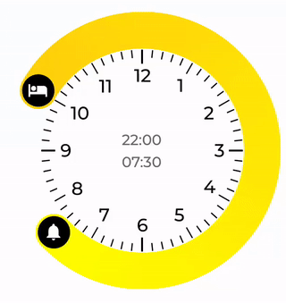

# react-native-clock-interval
React Native Time interval control similar to iOS12 Bedtime picker



| react-native |  |
|:------------:|:-----:|
| <0.60 | 1.?.? |
| 0.60+ | 2.?.? |

## Installation

`yarn add react-native-clock-interval @react-native-community/art`

## Usage

```js
import TimeInterval from 'react-native-clock-interval';

<TimeInterval
  disabled={false}
  allowLineDrag={true}
  componentSize={300}
  indicatorSize={40}
  lineWidth={40}
  step={5 /* minutes */}
  lineColor={"green" /* or array of two colors for gradient, eg.: ['gold', 'yellow']*/}
  start={{hour: 22, minute: 0}}
  stop={{hour: 7, minute: 30}}
  onChange={(start, stop) => {/* called on every change, use with caution */}}
  onRelease={(start, stop) => {/* called in the end of interaction */}}
  startIndicator={() => <View>{/* custom indicator layout */}</View>}
  stopIndicator={() => <View>{/* custom indicator layout */}</View>}
  />
```

## License

[MIT License](http://opensource.org/licenses/mit-license.html). © Pavel Zarecky 2019
